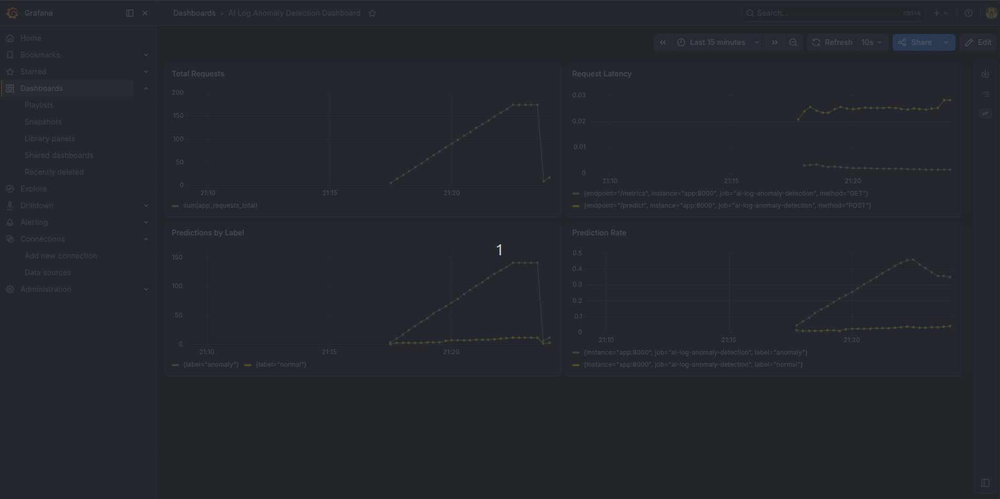
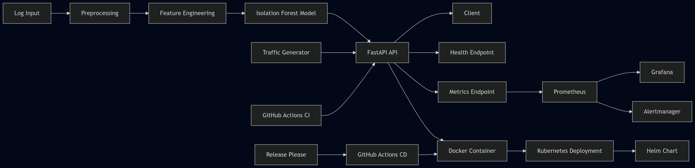
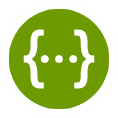

# AI-based Log Anomaly Detection System


---

## Table of Contents

- [AI-based Log Anomaly Detection System](#ai-based-log-anomaly-detection-system)
  - [Table of Contents](#table-of-contents)
  - [Overview](#overview)
  - [Quick Demo](#quick-demo)
    - [Access services](#access-services)
    - [Default Grafana credentials:](#default-grafana-credentials)
  - [Why This Project Matters](#why-this-project-matters)
  - [Project Status](#project-status)
  - [Development Workflow](#development-workflow)
  - [Security Considerations](#security-considerations)
  - [Features](#features)
  - [Tech Stack](#tech-stack)
  - [Architecture](#architecture)
    - [System Diagram](#system-diagram)
  - [Project Structure](#project-structure)
  - [Configuration](#configuration)
    - [Example](#example)
  - [Note: You can also copy `.env.example` and adapt the values for your environment.](#note-you-can-also-copy-envexample-and-adapt-the-values-for-your-environment)
  - [Getting Started](#getting-started)
    - [1. Clone the repository](#1-clone-the-repository)
    - [2. Create a virtual environment](#2-create-a-virtual-environment)
      - [Windows](#windows)
      - [macOS / Linux](#macos--linux)
    - [3. Install dependencies](#3-install-dependencies)
      - [Production](#production)
      - [Development \& testing](#development--testing)
    - [4. Train the model](#4-train-the-model)
    - [5. Run the API](#5-run-the-api)
    - [6. Access API](#6-access-api)
  - [Run with Docker](#run-with-docker)
    - [Build the image](#build-the-image)
    - [Run the container](#run-the-container)
  - [Kubernetes Deployment](#kubernetes-deployment)
    - [Apply Kubernetes manifests](#apply-kubernetes-manifests)
    - [Verify resources](#verify-resources)
    - [Port-forward the service](#port-forward-the-service)
    - [Access the application](#access-the-application)
  - [Helm Deployment](#helm-deployment)
    - [Lint the chart](#lint-the-chart)
    - [Render Kubernetes manifests](#render-kubernetes-manifests)
    - [Install the chart](#install-the-chart)
    - [Upgrade the release](#upgrade-the-release)
    - [Uninstall the release](#uninstall-the-release)
  - [Continuous Delivery](#continuous-delivery)
    - [Published image](#published-image)
    - [Pull the latest image](#pull-the-latest-image)
  - [API Endpoints](#api-endpoints)
    - [GET /](#get-)
    - [GET /health](#get-health)
    - [POST /predict](#post-predict)
    - [Request Body](#request-body)
      - [Example Request](#example-request)
      - [Example Response](#example-response)
      - [Notes](#notes)
    - [GET /metrics](#get-metrics)
  - [Observability](#observability)
    - [Available metrics](#available-metrics)
  - [Monitoring Setup](#monitoring-setup)
    - [Prometheus](#prometheus)
    - [Run Prometheus with the sample config](#run-prometheus-with-the-sample-config)
    - [Grafana](#grafana)
    - [Alerting](#alerting)
  - [Local Monitoring Stack](#local-monitoring-stack)
    - [Start the stack](#start-the-stack)
    - [Access the services](#access-the-services)
    - [Default Grafana credentials](#default-grafana-credentials-1)
  - [Traffic Generator](#traffic-generator)
    - [Run with Docker Compose](#run-with-docker-compose)
    - [Run the traffic generator (local)](#run-the-traffic-generator-local)
      - [Configuration](#configuration-1)
      - [Example (custom configuration)](#example-custom-configuration)
      - [Notes](#notes-1)
  - [Running Tests](#running-tests)
    - [Run all tests](#run-all-tests)
    - [Run tests with coverage](#run-tests-with-coverage)
    - [Run lint checks](#run-lint-checks)
  - [Security Checks](#security-checks)
    - [Static analysis](#static-analysis)
    - [Dependency vulnerabilities](#dependency-vulnerabilities)
    - [Linting](#linting)
  - [Future Enhancements](#future-enhancements)
  - [License](#license)
  - [Author](#author)
  - [Screenshots](#screenshots)

## Overview

This project is an end-to-end AI and MLOps system designed to detect anomalies in application and infrastructure logs using machine learning techniques.

It simulates a real-world production scenario where logs are collected, processed, analyzed, and served through an API.

This project focuses on bridging the gap between machine learning models and production systems through a practical MLOps approach.

---

## Quick Demo

Run the full stack locally:

```bash
docker compose up --build
```

### Access services

- API: http://127.0.0.1:8000
- Prometheus: http://127.0.0.1:9090
- Grafana: http://127.0.0.1:3000
- Alertmanager: http://127.0.0.1:9093

### Default Grafana credentials:
```text
Username: admin
Password: admin
```

<p align="center">
  
</p>
<p align="center">
  <em>Real-time monitoring with Prometheus and Grafana</em>
</p>

---

## Why This Project Matters

This project demonstrates a production-minded MLOps workflow by combining:

- machine learning-based anomaly detection
- API serving with FastAPI
- observability with Prometheus-compatible metrics
- containerization with Docker
- Kubernetes and Helm deployment artifacts
- CI/CD automation with GitHub Actions and release workflows

---

## Project Status

✅ Production-Ready (Demo) – This project demonstrates a complete MLOps pipeline, including model serving, observability, alerting, and automated CI/CD workflows.

It is intended as a practical, production-style implementation for learning and portfolio purposes.

Next phase: scaling, deployment automation, and system optimization.

---

## Development Workflow

- Feature-based development with Git commits
- Incremental implementation (API → ML → Deployment)
- Unit, API, and security testing at each phase
- Continuous documentation updates
- Separate production and development dependencies
- Linting and security checks for code quality assurance
- Automated CI checks for testing, linting, and security scanning
- Continuous validation of Kubernetes manifests and Helm deployment templates

---

## Security Considerations

- Input validation using Pydantic
- Static code analysis using Bandit
- Dependency vulnerability scanning using pip-audit
- No hardcoded secrets or credentials

---

## Features

* Input preprocessing for structured log features
* Feature preparation for anomaly detection input
* Anomaly detection using machine learning
* REST API built with FastAPI
* Input validation using Pydantic
* Unit, API, and security testing
* Docker support for containerization
* Production-ready Kubernetes deployment with manifests and Helm chart
* Dockerized application for portable execution
* GitHub Actions CI for automated quality and security checks
* Environment-based configuration for runtime settings
* Structured application logging
* Non-root Docker container for improved container security
* Prometheus-compatible metrics endpoint
* Request and prediction observability
* Automated CD workflow for container build and registry publishing
* Prometheus scraping configuration and Grafana dashboard guidance
* Registry-aware image tagging for reproducible releases
* Automated semantic version tagging and GitHub release generation
* Ready-to-import Grafana dashboard for monitoring application behavior
* Configurable traffic generator for simulating real-time prediction workloads
* Docker Compose-based local stack with automated traffic generation
* Auto-provisioned Grafana datasource and dashboard setup
* Real-time anomaly alerting using Prometheus and Alertmanager
* Alertmanager notification integrations (Slack)
* Kubernetes readiness, liveness, and startup probes
* Resource requests and limits for safer scheduling
* Hardened container and pod security settings
* Rolling update strategy for safer deployments
* CI validation for Kubernetes manifests and Helm charts

---

## Tech Stack

* Python
* FastAPI
* Pandas
* Scikit-learn
* Docker
* Kubernetes
* Pytest
* Bandit
* pip-audit
* Ruff
* Makefile
* GitHub Actions
* Helm
* Prometheus client
* GitHub Container Registry (GHCR)
* Prometheus
* Grafana
* Slack
* kubectl
* Helm linting and template validation

---

## Architecture

The system follows a typical MLOps pipeline:

Logs → Preprocessing → Feature Engineering → ML Model → Prediction API → Client

- Logs are collected from applications and infrastructure
- Data is preprocessed and transformed into structured features
- A machine learning model detects anomalies
- Results are served via a REST API

### System Diagram

<p align="center">
  
</p>
<p align="center">
  <em>End-to-end MLOps architecture with observability and alerting</em>
</p>

---

## Project Structure

```text
ai-log-anomaly-detection/
├── app/                      # FastAPI application
│   ├── config.py             # Environment-based runtime settings
│   ├── logging_config.py     # Logging setup
│   ├── main.py
│   ├── metrics.py
│   ├── middleware.py
│   ├── schemas.py
│   └── services/             # Business logic (ML, preprocessing, etc.)
│
├── ml/                       # Model training & offline ML logic
│   ├── train.py
│   ├── predict.py
│
├── tests/                    # Unit, API, and security tests
│   ├── api/
│   ├── unit/
│   └── security/
│
├── models/                   # Trained ML models (ignored in git if needed)
│
├── monitoring/               # Prometheus and Grafana integration files
│   ├── prometheus.yaml
│   ├── grafana-dashboard-notes.md
│   └── grafana/
│       ├── ai-log-anomaly-dashboard.json
│       └── provisioning/
│           ├── dashboards/
│           │   └── dashboard.yaml
│           └── datasources/
│               └── datasource.yaml
│   ├── alerts.yaml              # Prometheus alert rules
│
├── scripts/                  # Utility scripts
│   └── generate_traffic.py   # Local traffic generator
│
├── docs/                     # Documentation & screenshots
│   ├── architecture.md
│   ├── swagger.png
│   └── metrics.png
│
├── helm/                     # Helm chart for Kubernetes deployment
│   └── ai-log-anomaly-detection/
│       ├── Chart.yaml
│       ├── values.yaml
│       └── templates/
│
├── k8s/                      # Kubernetes manifests
│   ├── deployment.yaml
│   ├── service.yaml
│   └── namespace.yaml
│
├── .env.example                # Example environment variables
├── .gitignore
├── .dockerignore
│
├── requirements.txt          # Production dependencies
├── requirements-dev.txt      # Development & testing dependencies
│
├── pytest.ini                # Pytest configuration
├── ruff.toml                 # Linting configuration
├── Makefile                  # Development commands (optional)
│
├── Dockerfile
├── docker-compose.yml         # Local observability stack (app + Prometheus + Grafana)
└── README.md
```

---

## Configuration

The application supports basic runtime configuration through environment variables.

### Example
```bash
export APP_NAME="AI Log Anomaly Detection API"
export MODEL_PATH="models/isolation_forest.pkl"
export LOG_LEVEL="INFO"
```
Note: You can also copy `.env.example` and adapt the values for your environment.
---
## Getting Started

### 1. Clone the repository

```bash
git clone <your-repo-url>
cd ai-log-anomaly-detection
```

### 2. Create a virtual environment

#### Windows

```bash
python -m venv venv
venv\Scripts\activate
```

#### macOS / Linux

```bash
python3 -m venv venv
source venv/bin/activate
```
### 3. Install dependencies
#### Production
```bash
pip install -r requirements.txt
```

#### Development & testing
```bash
pip install -r requirements-dev.txt
```

---

### 4. Train the model
```bash
python ml/train.py
```

---

### 5. Run the API

```bash
uvicorn app.main:app --reload
```

---

### 6. Access API

* http://127.0.0.1:8000
* http://127.0.0.1:8000/docs

---
## Run with Docker

### Build the image
```bash
docker build -t ai-log-anomaly-detection:latest .
```

### Run the container
```bash
docker run --rm -p 8000:8000 ai-log-anomaly-detection:latest
```

---

## Kubernetes Deployment

The Kubernetes manifests include:
- rolling update deployment strategy
- readiness, liveness, and startup probes
- resource requests and limits
- non-root security settings

### Apply Kubernetes manifests
```bash
kubectl apply -f k8s/namespace.yaml
kubectl apply -f k8s/deployment.yaml
kubectl apply -f k8s/service.yaml
```

### Verify resources
```bash
kubectl get all -n ai-log-anomaly
```

### Port-forward the service
```bash
kubectl port-forward svc/ai-log-anomaly-detection 8000:80 -n ai-log-anomaly
```

### Access the application

- http://127.0.0.1:8000
- http://127.0.0.1:8000/docs

---

## Helm Deployment

### Lint the chart
```bash
helm lint helm/ai-log-anomaly-detection
```

### Render Kubernetes manifests
```bash
helm template ai-log-anomaly-detection helm/ai-log-anomaly-detection
```

### Install the chart
```bash
helm install ai-log-anomaly-detection helm/ai-log-anomaly-detection
```

### Upgrade the release
```bash
helm upgrade ai-log-anomaly-detection helm/ai-log-anomaly-detection
```

### Uninstall the release
```bash
helm uninstall ai-log-anomaly-detection -n ai-log-anomaly
```

---
## Continuous Delivery

The project includes a GitHub Actions CD workflow that:

- Builds the Docker image automatically
- Publishes the image to GitHub Container Registry (GHCR)
- Applies registry-aware image tagging for traceability and release management
- Automatically creates versioned Git tags and GitHub releases using Release Please

The CI pipeline also validates:
- Kubernetes manifest validation with kubeconform
- Helm chart syntax with `helm lint`
- Helm template rendering with `helm template`

### Published image
```text
ghcr.io/saeedya/ai-log-anomaly-detection
```

### Pull the latest image
```bash
docker pull ghcr.io/saeedya/ai-log-anomaly-detection:latest
```

Pull a specific release image example:
```bash
docker pull ghcr.io/saeedya/ai-log-anomaly-detection:v1.0.0
```

---

## API Endpoints

### GET /

Returns basic project info

### GET /health

Returns API health status

### POST /predict
Runs anomaly detection on structured log features using the trained ML model.

### Request Body

```json
{
  "response_time": 120,
  "status_code": 200,
  "request_count": 15
}
```

| Field         | Type    | Description                       | Example |
| ------------- | ------- | --------------------------------- | ------- |
| response_time | integer | Response time in milliseconds     | 120     |
| status_code   | integer | HTTP status code                  | 200     |
| request_count | integer | Number of requests in time window | 15      |

#### Example Request

```bash
curl -X POST http://127.0.0.1:8000/predict \
  -H "Content-Type: application/json" \
  -d '{
        "response_time": 120,
        "status_code": 200,
        "request_count": 15
      }'
```

#### Example Response

```json
{
  "prediction": 1,
  "label": "normal"
}
```

| Field      | Type    | Description                            |
| ---------- | ------- | -------------------------------------- |
| prediction | integer | Model output (0 = anomaly, 1 = normal) |
| label      | string  | Human-readable label                   |


| Status Code | Description                      |
| ----------- | -------------------------------- |
| 200         | Prediction successful            |
| 422         | Invalid input (validation error) |
| 500         | Internal server error            |

#### Notes

- Input validation is handled using Pydantic.
- All fields are required.
- Invalid inputs will result in a 422 response.
- This endpoint also emits Prometheus metrics:
    - model_predictions_total

### GET /metrics

Exposes Prometheus-compatible application metrics for observability and monitoring.

---

## Observability

The application exposes Prometheus-compatible metrics at:

```bash
GET /metrics
```

These metrics can be scraped by Prometheus and visualized in Grafana dashboards.

### Available metrics

* app_requests_total
* app_request_duration_seconds
* model_predictions_total

---
## Monitoring Setup

### Prometheus

A sample Prometheus configuration is available in:

```text
monitoring/prometheus.yaml
```

It is configured to scrape the application's /metrics endpoint

### Run Prometheus with the sample config
```bash
prometheus --config.file=monitoring/prometheus.yaml
```

### Grafana

Suggested dashboard ideas are documented in:

monitoring/grafana-dashboard-notes.md

These notes describe recommended panels for:

- request volume
- request latency
- prediction counts
- health monitoring

A sample Grafana dashboard definition is available at:

```text
monitoring/grafana/ai-log-anomaly-dashboard.json
```

It can be imported into Grafana to visualize:

- total requests
- request latency
- prediction counts by label
- prediction rate

Grafana provisioning files are included for automatic startup configuration:

```text
monitoring/grafana/provisioning/
```

This automatically configures:

- the Prometheus datasource
- the application dashboard

No manual Grafana setup is required after starting the Docker Compose stack.

### Alerting

Prometheus alert rules are defined in:

monitoring/alerts.yaml

These rules detect abnormal system behavior such as high anomaly rates.

Alerts are managed via Alertmanager:

These rules detect abnormal system behavior such as high anomaly rates.

Alerts are routed through Alertmanager and can be delivered to external notification channels such as Slack.

Alertmanager UI

- http://127.0.0.1:9093

Alertmanager can be configured to send Slack notifications when alert conditions are met.

Example configuration template:

```text
monitoring/alertmanager.example.yaml
```

To enable Slack notifications:

1. Copy the example file
2. Add your Slack webhook URL
3. Restart the Docker Compose stack

Example workflow:

1. The application exposes metrics at /metrics
2. Prometheus scrapes application metrics
3. Alert rules evaluate anomaly behavior
3. Alertmanager routes alerts to Slack

This provides real-time operational visibility for anomaly spikes and abnormal system behavior

---

## Local Monitoring Stack

The project includes a Docker Compose setup for running:

- the FastAPI application
- Prometheus
- Grafana
- A traffic generator for automatic metric population

The Grafana datasource and dashboard are provisioned automatically at startup.

### Start the stack
```bash
docker compose up --build
```
### Access the services

- Application: http://127.0.0.1:8000
- Prometheus: http://127.0.0.1:9090
- Grafana: http://127.0.0.1:3000

### Default Grafana credentials

- Username: admin
- Password: admin

---

## Traffic Generator

A traffic generator is included for demo and testing purposes.

It continuously sends a mix of normal and anomaly-like payloads to the `/predict` endpoint.

This helps demonstrate:
- model predictions
- request metrics
- Grafana dashboard activity

### Run with Docker Compose
```bash
docker compose up --build
```

When running through Docker Compose, the traffic generator automatically targets the internal application service.

### Run the traffic generator (local)
```bash
python scripts/generate_traffic.py
```

#### Configuration

The traffic generator supports environment-based configuration:

| Variable      | Default                                                        | Description                      |
| ------------- | -------------------------------------------------------------- | -------------------------------- |
| PREDICT_URL   | [http://127.0.0.1:8000/predict](http://127.0.0.1:8000/predict) | Target API endpoint              |
| SLEEP_SECONDS | 2                                                              | Delay between requests (seconds) |

#### Example (custom configuration)

export PREDICT_URL=http://127.0.0.1:8000/predict
export SLEEP_SECONDS=1

python scripts/generate_traffic.py

#### Notes

- Generates both normal and anomaly-like inputs
- Designed for demo and testing purposes
- Useful for populating Prometheus metrics and Grafana dashboards

---

## Running Tests

### Run all tests

```bash
pytest
```

### Run tests with coverage
```bash
pytest --cov=app --cov=ml
```

### Run lint checks
```bash
ruff check .
```
---

## Security Checks

### Static analysis

```bash
bandit -r app ml
```

### Dependency vulnerabilities

```bash
pip-audit -r requirements.txt
pip-audit -r requirements-dev.txt
```

### Linting

```bash
ruff check .
```

---

## Future Enhancements

- Automated Kubernetes deployment via CI/CD pipelines
- Advanced alert routing and notification strategies
- Autoscaling and resilience improvements

---

## License

This project is for educational and demonstration purposes.

---

## Author

Saeed Yasrebi

---

## Screenshots

<p align="center">
  
  
</p>
<p align="center">
  <em>Swagger UI & Prometheus Metrics</em>
</p>


